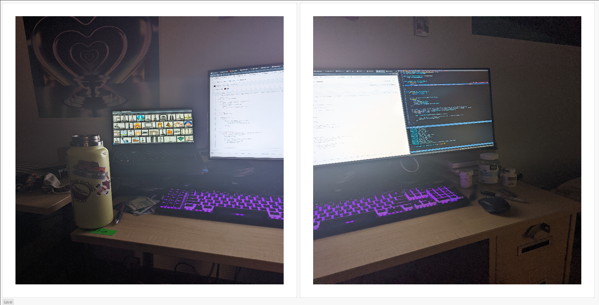

- [Project 3](#sec-1)
  - [Image Mosaics](#sec-1-1)
  - [Creating a GUI](#sec-1-2)
  - [First (Time) Warp](#sec-1-3)
  - [First Blend](#sec-1-4)
  - [Better Blending](#sec-1-5)
  - [Choosing Images and Blending Techniques](#sec-1-6)
    - [Failures](#sec-1-6-1)
    - [Success](#sec-1-6-2)
  - [Conclusion](#sec-1-7)

# Project 3<a id="sec-1"></a>

## Image Mosaics<a id="sec-1-1"></a>

Capturing an image that spans some sort of large width can be difficult. One possible way is to get a wide angle lens, the downside being the FOV distortion. Another downside is while you may be capturing more, there could be angles you're missing, different lighting possibilities, and much more. From here we can see a possible alternative, taking multiple photos, and merging them into one. If done correctly, this can result in different information in the photo, and possibly more than with a single shot photo even with a wide angle lens.

To actually do this, we need a few techniques, but roughly the process looks like this:

1.  Take multiple photos
2.  Identify similar points between the images
3.  Find a homography between the points
4.  Warp the image according to the homography
5.  Blend the images

## Creating a GUI<a id="sec-1-2"></a>

As outlined before the first step is to take photos, but we'll actually go over this step last for a few reason, right now assume we have some suitable images, such as my desk:


Clearly these two images are of the same desk, and if we merge them we would have the full thing. So now that we have some images, we need a way to identify the similar points, for example the tab icons open, and the keys on the keyboard, as these spots are easily identifiable and shared between both angles.

Since I once again chose Rust to do this project, I ran into a pretty big issue, namely that there's no built in support for clicking on images, and saving those points. So our first step is to build a GUI just like this.

To do so, I chose to use [egui](https://github.com/emilk/egui), a relatively simple GUI framework. Luckily there's built in support for an image plot, and buttons, so creating the GUI was pretty easy, just load the images in the plotter, and save the coordinates of the cursor every click.

Showing an image in a plotter and saving the points:

```rust
plot_a
    .allow_drag(false)
    .show_axes([false, false])
    .height(800.0)
    .width(800.0)
    .show(ui, |plot_ui| {
        // show image
        plot_ui.image(plot_image_a.name("image_a"));
        // save points
        if plot_ui.plot_clicked() {
            let mut coord = plot_ui.pointer_coordinate().unwrap();
            coord.y = self.image_a_orig.height() as f64 - coord.y;
            self.points_a.insert(0, coord);
            if self.points_a.len() > 4 {
                self.points_a.pop();
            }
        }
    });
```

Then we can add a button to merge the photos and save them once that is done. Altogether the gui looked like this:

Merge option: 

Save option: 

Saving the image would save the result to out.jpg which I would rename if I liked the result. Not shown is the third image plot where the result would be displayed. The reason I didn't include a screengrab of this was it required some weird resizing and shifting of the gui window to see, and it didn't look great.

## First (Time) Warp<a id="sec-1-3"></a>

Now that we have some points and images, we need to find the homography between the two points. This requires a lot of linear algebra, but luckily there's a handy dandy Rust library to do it for us called [ArrayFire](https://arrayfire.com/), and it's pretty fast too. I created this function that simply takes the points needed, and returns a 3x3 matrix representing the homography:

```rust
fn find_homography(a: Vec<Value>, b: Vec<Value>) -> [f32; 9] {
    // Various setups like converting types
    let mut v = [1.0; 9];
    let mut x_src = [0.0; 4];
    let mut y_src = [0.0; 4];
    let mut x_dst = [0.0; 4];
    let mut y_dst = [0.0; 4];
    for i in 0..a.len() {
        x_src[i] = a[i].x as f32;
        y_src[i] = a[i].y as f32;
        x_dst[i] = b[i].x as f32;
        y_dst[i] = b[i].y as f32;
    }
    let x_src = Array::new(&x_src, Dim4::new(&[4, 1, 1, 1]));
    let y_src = Array::new(&y_src, Dim4::new(&[4, 1, 1, 1]));
    let x_dst = Array::new(&x_dst, Dim4::new(&[4, 1, 1, 1]));
    let y_dst = Array::new(&y_dst, Dim4::new(&[4, 1, 1, 1]));
    // Find the homography!
    let (h, i): (Array<f32>, i32) = homography(
        &x_src,
        &y_src,
        &x_dst,
        &y_dst,
        arrayfire::HomographyType::RANSAC,
        100000.0,
        10,
    );
    // Print it out
    print(&h);
    //Copy it to the 3x3 matrix
    h.host(&mut v);
    v
}
```

What's neat about this library is it uses RANSAC, meaning if I chose to, I could include a lot more points than just four for actually finding the homography, and the RANSAC algorithm would hopefully choose the best. Instead of doing this, I tried to stick to the project expectation of just using 4 points.

I didn't have a great way of saving the warped image, so there's no examples, and instead we'll jump right into blending. Basically I saw that the warping "looked" right and went straight to merging the photos.

## First Blend<a id="sec-1-4"></a>

Now that we have two photos, both from the same perspective, all that's left is to overlay them somehow. When I did the warping, for simplicity's sake I kept the left image the same, and warped the right image to match.

To actually do the warping, I again used `image` and `imageproc` two standard image processing libraries for Rust. Sometimes the warped image would be warped essentially off screen, as we were "extending" the first photo to the right, meaning the new data would be off the edge of the canvas. To overcome this, I simply doubled the width of the warped image before warping it, filling the empty space with black pixels that have an alpha value of zero. This actually worked really well, and the only side effect was some images needed cropping as there was left over blank canvas.

As far as the merging goes, I first tried taking the warped image, and replaced all blank pixels (those with a zero alpha value from before) with the first image, and when the two photos actually overlapped, I simply averaged all RGB channels.

The actual code looked like:

```rust
fn overlay_into(a: &DynamicImage, b: &mut DynamicImage){
    for y in 0..a.height(){
        for x in 0..a.width(){
            let mut p = a.get_pixel(x, y);
            let q = b.get_pixel(x, y);
            // If alpha channel is zero (blank)
            if p.0[3] == 0{
                //Literally just copy in the first image's pixel
                p = q;
            }else if q.0[3] != 0{
                //If both are not blank average all the channels with no weighting
                p.apply2(&q, |c1, c2| ((c1 as u16 + c2 as u16)/2).min(u8::MAX.into()) as u8);
            }
            // Write the pixel
            b.put_pixel(x, y, p);
        }
    }
}
```

The result looked like this:


First off, we see that the warping worked almost perfectly, although there's some discrepancies between the lineup, I also didn't focus too hard clicking the matching points. The main con of this photo is also pretty obvious, the right side is much more exposed than the left, meaning that no matter how well we match points, the divide will be obvious. Clearly the averaging wasn't enough to take care of this. I decided that this is what I wanted to pursue for my bells and whistles, as I wanted to see if I could merge the photos better without taking new ones. To be specific I had one goal in mind when merging: somehow balancing the lighting and color differences between photos. I cared about the border artifacts, but frankly I cared more that the lighting might be different as I felt that was more distracting.

## Better Blending<a id="sec-1-5"></a>

Now with a new goal in mind, I decided I needed some new photos. Since my focus was on lighting, I had an idea of what would be good test photos. Namely two images of the same object, where one side is lit in one photo and the other side is lit in the other.

I have a sunset lamp in my bedroom, which is literally a lamp that looks like a sunset ([see here for an example](https://www.google.com/url?sa=i&url=https%3A%2F%2Fwww.amazon.com%2FProjector-Projection-Rotation-Romantic-Photography%2Fdp%2FB08Z3LGYT7&psig=AOvVaw2vbxpjG6SfopxPpSaBymL0&ust=1649649125149000&source=images&cd=vfe&ved=0CAsQjhxqFwoTCJCjloPMiPcCFQAAAAAdAAAAABAI)). I then chose something that's almost impossible to photograph in real life, the White House. Really it was my Lego White House set, but I thought it'd be interesting.

In this first image, we see the full set, lit by the lamp clearly from the right:


Then, I took a closeup but with the lighting from the left:


An advantage of these photos, is that one would *completely* overlap the other, meaning any sort of blending issues would be a lot more obvious than if we used my desk image, as that only had a relatively small overlap.

I tried running the same exact function I had before to see where I stand:


Clearly I clicked on some points wrong, and so I tried two more times and was a bit more careful:


So although the warping is a bit off, we see a bigger issue: the first image was just overwriting the second, there was no real blending going on. We can see this in the desk image too, and it wasn't just the averaging wasn't enough, it wasn't working at all.

I fixed the logic issue I had, but the results weren't any better anyways, so I went straight to more advanced methods.

Just averaging: 

I tried to implement a laplacian pyramid for a bit, but I didn't completely understand it, and it really didn't fit my goals anyways, as I wanted to overlay one image completely on top of another, not just blur the edges of two together. I did take away one interesting technique from it though, namely that by merging two images and blurring them, down scaling them and repeating can help sell that two images are one. So instead of using some sort of mask, I first averaged the pixels of the two images similar to what I did before, but then downscaled blurred and repeated:

```rust
// Downscaled and blurred by a factor of 8 
let b_n_a: DynamicImage = image::DynamicImage::ImageRgba8(resize(
    &b_n,
    b_n.width() / 8,
    b_n.height() / 8,
    image::imageops::FilterType::Nearest,
));
// repeat again
b_n_a.blur(100.0);
let b_n_b: DynamicImage = image::DynamicImage::ImageRgba8(resize(
    &b_n_a,
    b_n_a.width() / 8,
    b_n_a.height() / 8,
    image::imageops::FilterType::Nearest,
));
b_n_b.blur(200.0);
```

My intuition for this, was that instead of blending individual pixels, we also now were doing so including some information about its neighbors, and by scaling we did so on different neighborhood levels.

I then upscaled these images back to the original size, and saved them in some variables for later. Then, I again began to blend the original photo and warped photo, but instead of using the warped photo I blended in the first blended photo, and the two smaller/blurred photos, with some weighting according to alpha channels. I also attempted to change the alpha channel of the blended photo according to the pixel's distance from the center of the homography points:

```rust
// Set alpha channels to weight the blending
// Smaller photo
p_a.0[3] = 185;
// Smallest
p_b.0[3] = 125;

// Blend all three photos together
p_a.blend(&p_b);
p.blend(&p_a);
// Set alpha according to distance from center
p.0[3] = distance_alpha(center, (x as f64, y as f64), b.width());

// Blend first photo and all merged photos
if r.0[3] != 0 {
    r.0[3] = 150;
    p.blend(&r);
}
p.0[3] = 255;
```

I didn't implement all of this at once, but I first started with the blended photo + first photo, and that looked better, and moved on adding the other blending modifiers.

Here's the results:


As far as lighting goes, this feels a lot better as we can see the left side of the white house has shadows that aren't as dark, and the actual building and cherry blossom tree is lit up more. Clearly the homography wasn't perfect, and I tried a few more choices, but I couldn't get anything better. Still, I felt better about the blending, and went back to my desk photo:


In my opinion this looked *a lot* better, but there was some ghosting which wasn't ideal. If I were to redo this project, I'd most likely focus on improving that ghosting, by trying better ways to choose the alpha values for blending, and possibly cutting off where in the picture to do the blending.

## Choosing Images and Blending Techniques<a id="sec-1-6"></a>

As we saw before, not all images were ideal for mosaicing.

### Failures<a id="sec-1-6-1"></a>

For example, we saw from the white house that sometimes there's too much detail to overlap, and a simple four point homography isn't enough.

I also attempted to merge two birds eye view photos:


But there wasn't enough overlap between the images:


In fact I realized there was almost no overlap! I did have some interesting successes besides the desk image though

### Success<a id="sec-1-6-2"></a>

Consider this vitamin D bottle with and without its cap on:


What if we tried to combine these two?

With some random blending weights we had:


Which I thought was interesting, but I couldn't see the pills well, so I weighted the pill image higher:


This gave an interesting x-ray effect I really liked, which I could see being used practically for some sort of movie/informational diagrams.

From here though I got a better idea, what if instead I inserted my eyes on some paintings? I could try taking photos of my eyes looking in various directions and crop and blend it manually, which could take forever. Instead I took one photo with almost no effort:


I then chose some famous portraits. Warning, the next few photos are a bit uncanny and spooky:


What I thought was funny was that my eyebrows made it through, as Mona Lisa doesn't have any. I was also pleasantly surprised by how well the nose lined up. I also think this photo shows even better the color/lighting blending, as my skintone seems a lot closer to the original photo. I also thought it was cool that the painting cracks came through.

Let's try weighting my eyes a little bit more:


I thought this didn't work as well as a merge, but it did remind me of Scooby Doo, where villains would peer through the eyes of paintings.

What if we don't blend much?


Clearly my blending effects the blockiness of the photo, the downside of this photo being that the blending isn't done as well color/lighting wise. An important note here is that the photo of my eyes is looking forward, but this homography makes my eyes look in the right direction.

Here's a more extreme example of the warping of my eyes to look in a certain direction (to the left):


With less blending:


Finally a funny outtake:


## Conclusion<a id="sec-1-7"></a>

Overall I felt successful with this project, creating my own GUI, getting the original homographies working well, and finding a way to blend colors and lighting in a somewhat convincing way. I definitely see clear ways to improve, for example using RANSAC properly with more points, implementing the Laplacian pyramid properly, and trying to make the blurriness and blockiness of the blending localized only to the overlap.
